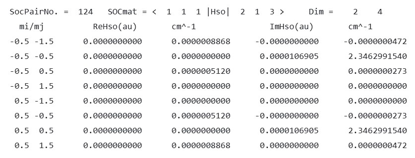

**SOCMEs Examples**  

  

In BDF, the output format for each SOC matrix element line is:  

fileA symA stateA fileB symB stateB  

which represents the matrix element

$\langle$ fileA, symA, stateA $| \hat{\mathrm{H}}_{\mathrm{SOC}} \mid$ fileB, symB, stateB $\rangle$

Here, fileA symA stateA represents the stateA-th root of the irreducible representation symA in calculation file fileA. For example, 1 1 1 denotes the first root of the first irreducible representation in the first TDDFT calculation.  

In this example, the specified state pairs correspond to the $^2T_1$ and $^4T_1$ states, and the calculated matrix elements are the SOCMEs between these two electronic states.

For details, see the BDF User Guide: https://bdf-manual.readthedocs.io/en/latest/User%20Guide.html#spin-orbit-coupling-calculation-based-on-sf-x2c-tddft-soc